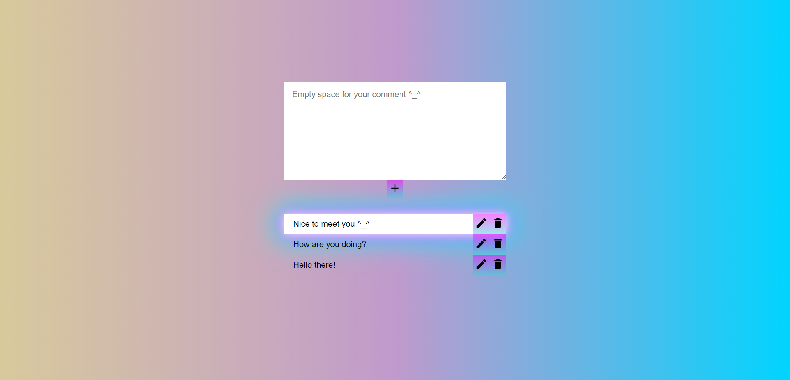

 

  

  <h3 align="center">Comments App</h3>

  

    Simple comments app made in ReactJS
     
     
    <a href="https://angelinanikolaeva.github.io/comments-app/">View Demo</a>
  

<h1 align="center"> About The Project </h1>

This is a simple ReactJS project for writing down comments with the ability to delete comments and edit them. All data is stored in localStorage. 

<h1 align="center"> Built With </h1>

ReactJS, Mui (Material-UI) and Nanoid  

